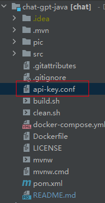
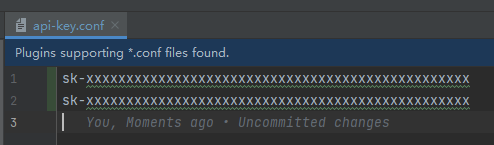
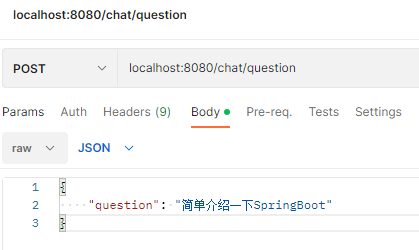
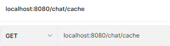

# ChatGPT-Java

#### 介绍
chatGPT-Java

#### 技术栈
1. Java 17
2. Maven
3. SpringBoot 3.0.2

#### 介绍

使用Java 操作 chatGPT API，支持对话上下文，可使用多个 API KEY

[API document](https://platform.openai.com/docs/api-reference/introduction)

[Community libraries](https://platform.openai.com/docs/libraries/community-libraries)

[Dependences client](https://github.com/TheoKanning/openai-java)

#### 使用说明

1. 所有配置`API KEY`在`api-key.conf` 文件中（每个apiKey用一行）。
   - 如图所示
      
     
     
2. `POST` `/chat/question`接口说明：对话
   headers(请求头):
    - content-type 请求类型为 `application/json`
    - sessionId 服务端自动生成返回的（非必须，与cookie二者存一即可）
    cookie
    - sessionId 服务端自动生成返回的（非必须，与headers二者存一即可，如果使用cookie，需要客户端支持cookie）

   body(请求体):
    - question 问题，字符串类型。必填
    
      
3. `GET` `/chat/config`接口说明：获取`chatGPT`参数配置 （仅适用于`dev`环境，会输出`apiKey`机密信息）
   - 不需要参数
   
     
4. `GET` `/chat/cache`接口说明：当前运行状态 （仅适用于`dev`环境，会输出`apiKey`机密信息）
    - 不需要参数
    
      
5. 其他注意事项
   - 项目未使用持久化策略，可自行实现

